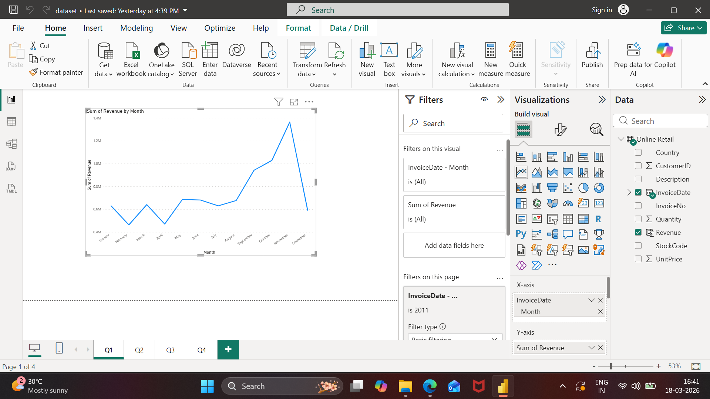
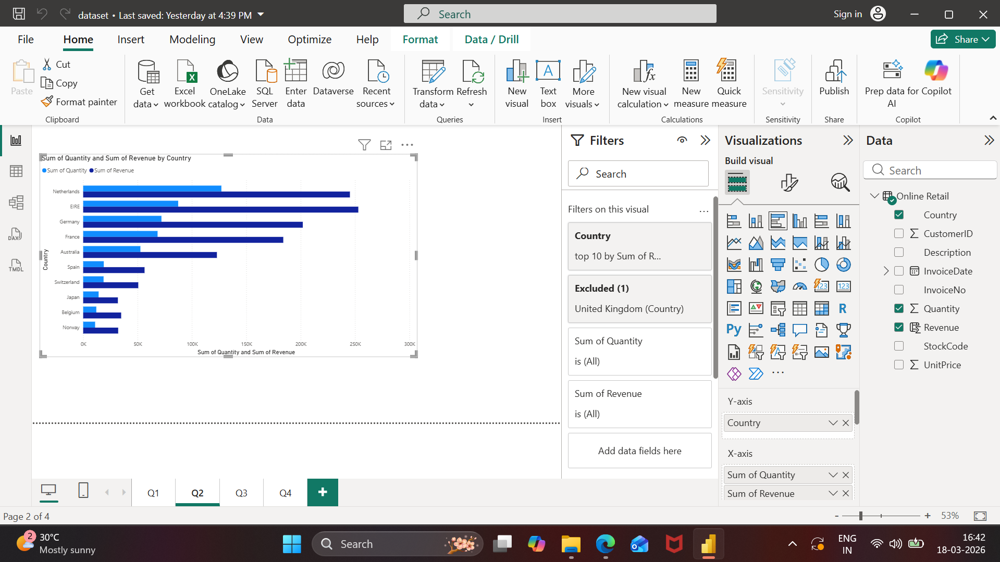
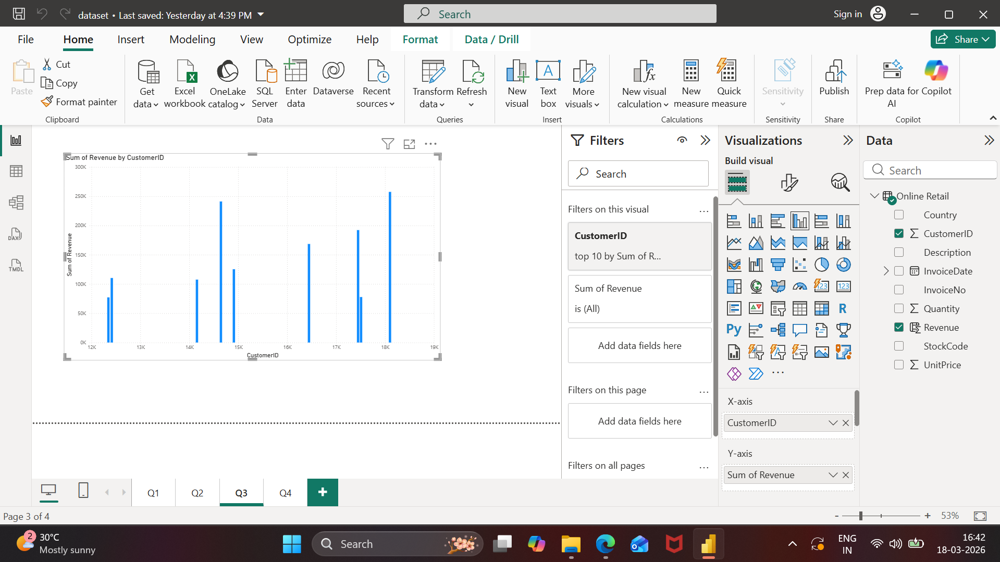
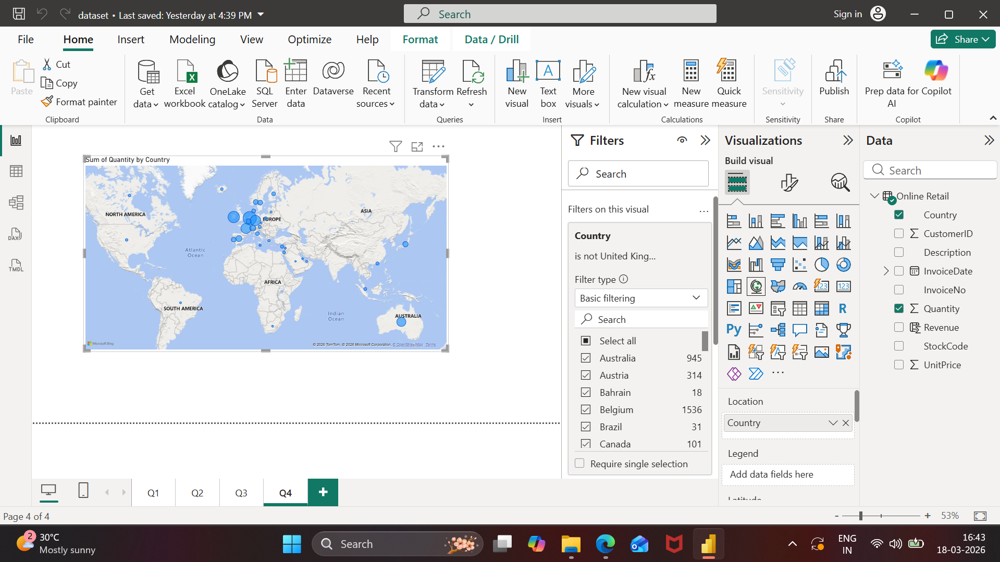

# Tata Data Visualisation Project

## Overview
This project was completed as part of the Tata Data Visualisation Virtual Experience Program. The goal was to analyze retail data and provide business insights using Power BI.

## Tools Used
- Power BI
- Data Cleaning
- Data Visualization

## Key Insights
- Analyzed monthly revenue trends for 2011
- Identified top countries generating revenue (excluding UK)
- Found high-value customers contributing most revenue
- Visualized product demand across regions

## Dashboard

### Q1 – Monthly Revenue Trend

**Insight:**
Revenue shows an increasing trend throughout the year, with a peak in November. This indicates strong seasonal demand, likely due to holiday sales.

### Q2 – Top Countries by Revenue

**Insight:**
Countries like Netherlands, Germany, and France generate high revenue, indicating strong international market potential.

### Q3 – Top Customers by Revenue

**Insight:**
A small group of customers contributes significantly to total revenue, highlighting the importance of customer retention strategies.

### Q4 – Product Demand by Country

**Insight:**
High demand is observed in European countries, suggesting expansion opportunities in these regions.

## Conclusion
This project demonstrates how data visualization can be used to extract meaningful insights and support business decision-making. The analysis highlights key revenue trends, high-value customers, and potential markets for expansion.

## 📜 Certificate

[Tata Data Visualisation Certificate](tata-data-visualisation-certificate.pdf)
